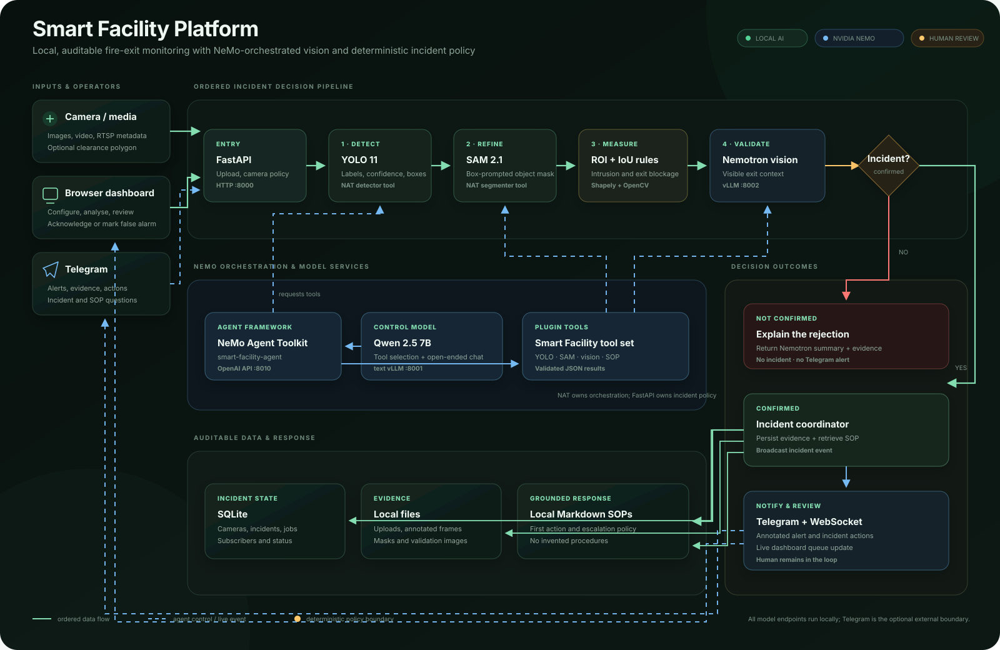

# Smart Facility Platform

Local-first facility-safety monitoring with YOLO object detection, optional
SAM 2 segmentation, deterministic clearance-zone geometry, Nemotron
multimodal validation, NVIDIA NeMo Agent Toolkit orchestration, SQLite incident
management, a browser dashboard, and Telegram response workflows.


The repository contains all of the integration points required by the current
Toolkit plugin model:

| Evidence | Repository implementation |
| --- | --- |
| Installable plugin package | `nemo_agent/pyproject.toml` |
| Plugin discovery entry point | `[project.entry-points."nat.plugins"]` |
| Stable public plugin API | `Builder`, `FunctionBaseConfig`, `FunctionInfo`, and `register_function` from `nat.plugin_api` |
| Registered tools | detector, segmenter, scene assessor, fire-exit validator, and SOP lookup |
| NAT workflow | `_type: tool_calling_agent` in `nemo_agent/config.yml` |
| Local controller LLM | NAT `_type: openai` pointed at the text vLLM endpoint |
| NAT server boundary | OpenAI-compatible `/v1/chat/completions` endpoint on port `8010` |
| Application client | `app/services/nemo_agent_client.py` |
| Runtime package | `nvidia-nat==1.8.0` in the current `.nemo-venv` |

The configuration has been checked with the installed CLI:

```bash
.nemo-venv/bin/dotenv -f .env run -- \
  .nemo-venv/bin/nat validate --config_file nemo_agent/config.yml
```

It resolves as a valid `tool_calling_agent` with five functions. The five
`smart_facility_*` components are also discoverable through `nat info
components`.

This is intentionally a hybrid system. NAT orchestrates model/tool decisions;
FastAPI, deterministic geometry, tracking, persistence, evidence files, and
notification delivery remain ordinary application code. That is consistent
with NVIDIA's description of NAT as a framework-agnostic orchestration layer,
not a replacement for the whole application.

Official references:

- [NeMo Agent Toolkit plugin system](https://docs.nvidia.com/nemo/agent-toolkit/latest/extend/plugins.html)
- [NeMo Agent Toolkit public plugin API](https://docs.nvidia.com/nemo/agent-toolkit/latest/extend/plugin-api.html)
- [Tool-calling agent configuration](https://docs.nvidia.com/nemo/agent-toolkit/latest/components/agents/tool-calling-agent/tool-calling-agent.html)
- [Using local OpenAI-compatible LLMs](https://docs.nvidia.com/nemo/agent-toolkit/latest/workflows/llms/using-local-llms.html)
- [NAT OpenAI-compatible server endpoint](https://docs.nvidia.com/nemo/agent-toolkit/latest/reference/rest-api/api-server-endpoints.html)

## NeMo, NAT, and Nemotron are different things

- **NeMo Agent Toolkit** is the orchestration framework used by this repo.
- **Nemotron** is the multimodal model served locally for image reasoning and
  candidate validation.
- **vLLM** serves both the control and vision models through local
  OpenAI-compatible APIs.
- **NeMo Framework** is NVIDIA's model training framework. This application
  does not train Nemotron and does not need NeMo Framework merely to serve the
  downloaded checkpoint.

The configured Nemotron checkpoint is
`nvidia/Nemotron-3-Nano-Omni-30B-A3B-Reasoning-NVFP4`. NVIDIA describes it as
an image, video, audio, and text model with a Mamba2/Transformer hybrid MoE
backbone. See the [official Nemotron model card](https://huggingface.co/nvidia/Nemotron-3-Nano-Omni-30B-A3B-Reasoning-NVFP4).

## Architecture



[Open the full-size SVG](docs/architecture.svg) ·
[Edit the Mermaid source](docs/architecture.mmd)

The solid green path is the required incident-decision order. Blue dashed
connections represent agent control or live event delivery. NeMo Agent Toolkit
orchestrates model tools, while FastAPI retains deterministic geometry,
incident state, evidence, and notification policy.

### Runtime roles

| Layer | Default | Purpose |
| --- | --- | --- |
| Web/API | FastAPI on `8000` | Uploads, camera policy, jobs, incidents, health, dashboard, WebSocket events, Telegram hooks |
| Agent framework | NVIDIA NeMo Agent Toolkit on `8010` | Tool selection and AI workflow orchestration |
| Control model | `Qwen/Qwen2.5-7B-Instruct` on `8001` | Drives the NAT tool-calling loop; Hermes tool parsing is enabled by the launcher |
| Vision model | `nvidia/Nemotron-3-Nano-Omni-30B-A3B-Reasoning-NVFP4` on `8002` | Grounded scene reasoning and fire-exit candidate validation |
| Detector | `yolo11n.pt` | Fast first-stage object localization |
| Segmenter | `sam2.1_hiera_tiny` | Converts qualifying YOLO boxes into object masks |
| Rules | Shapely + OpenCV | Computes auditable zone overlap and blockage ratios |
| Tracking | Local IoU tracker | Requires persistent blockage across sampled video frames |
| Storage | SQLite + local files | Cameras, incidents, jobs, subscribers, uploads, crops, and annotated evidence |
| Knowledge | `sops/*.md` | Grounded response steps and escalation policy |
| Notifications | Telegram | Annotated alerts, subscriptions, questions, acknowledgement, and false-alarm actions |

`smart-facility-agent` is the workflow identifier sent to NAT. It is not a
model checkpoint. Qwen is NAT's control model; Nemotron is invoked inside the
scene-assessor and validator tools.

### NeMo tools

| NAT function | Registered type | Work performed |
| --- | --- | --- |
| `facility_object_detector` | `smart_facility_object_detector` | Loads an image and returns normalized YOLO labels, confidence values, and boxes |
| `facility_segmenter` | `smart_facility_segmenter` | Runs SAM for one box and returns its polygon, mask area, score, prompt, model, and timing |
| `facility_scene_assessor` | `smart_facility_scene_assessor` | Sends an image plus grounded detections to Nemotron and normalizes structured findings |
| `facility_fire_exit_validator` | `smart_facility_fire_exit_validator` | Asks Nemotron whether a candidate visibly blocks an emergency-exit clearance area; full-frame mode preserves the complete exit scene |
| `facility_sop` | `smart_facility_sop` | Retrieves the most relevant local SOP excerpts and metadata |

The detector, segmenter, and scene-assessor tools use NAT `return_direct`, so
their validated JSON is returned to the FastAPI client without an extra LLM
paraphrase.

Incident summaries and free-form Telegram questions are single-shot text
generation rather than tool-selection workflows, so they call the text vLLM
directly. This prevents the five-tool NAT controller from selecting an image
tool after the grounded image pipeline has already completed.

## Processing workflows

### Fire-exit image analysis

1. The browser uploads an image and may supply a user-drawn polygon.
2. With no polygon, the full image becomes the clearance zone.
3. FastAPI stages the image for the NAT workflow.
4. NAT calls the YOLO detector tool.
5. Candidate classes and box/zone proximity are filtered cheaply.
6. NAT calls SAM only for qualifying candidates when SAM is enabled.
7. Application code computes object-intrusion and exit-blockage ratios from
   the mask, or from the YOLO box when the configured fallback applies.
8. A qualifying validation image is sent through NAT to Nemotron for visible
   confirmation. A drawn zone uses a bounded contextual crop; full-frame mode
   preserves the complete image so the door, signage, and approach path remain
   visible to the model.
9. The app stores an annotated incident, retrieves an SOP-grounded response,
   broadcasts a WebSocket event, and sends Telegram alerts.

The image UI uses a two-phase preview/commit path. The preview runs YOLO, SAM,
and geometry once, stores that stage in memory for five minutes, and returns a
`preview_token`. The commit request reuses the cached result before running the
more expensive vision and incident steps.

When no polygon is supplied, the full image is the exit zone. In that mode a
candidate still has to meet the configured object-intrusion threshold, but it
is not rejected merely because its mask occupies less than
`MINIMUM_EXIT_BLOCKAGE_RATIO` of the entire frame.

The committed-analysis response includes each Nemotron accept/reject decision,
confidence, summary, and visible evidence. The dashboard shows that explanation
when deterministic CV found a candidate but no incident or Telegram alert was
created.

### General scene analysis

This path is useful when the user has no clearance polygon or wants broader
parking, access, housekeeping, signage, or safety analysis.

1. YOLO produces grounded detections first.
2. NAT calls the scene-assessor tool with the image and detections.
3. Nemotron reasons from the visible image but may reference only those
   supplied detections as detected objects.
4. The app replaces model-proposed annotation boxes with YOLO-grounded boxes.
5. A supported violation becomes an incident with an event type such as
   `exit_blocked`, `fire_exit_obstruction`, `parking_violation`, or
   `scene_violation`.

### Video analysis

1. The upload is stored under `uploads/` and an `AnalysisJob` is queued.
2. OpenCV samples frames at `VIDEO_SAMPLE_FPS`.
3. YOLO detections are associated by the dependency-free IoU tracker.
4. SAM and deterministic geometry evaluate relevant tracked candidates.
5. A track must remain blocking for the camera's persistence threshold.
6. People are ignored by default or can use a longer person-specific duration.
7. Each qualifying track emits at most one incident per job.
8. The dashboard polls job progress and receives completion events over the
   WebSocket channel.

### Incident and response workflow

- Incidents have `open`, `acknowledged`, `false_alarm`, and `closed` states.
- Duplicate open/acknowledged incidents are suppressed during the configured
  camera cooldown; video duplicates are scoped to job and track.
- Evidence records YOLO boxes, optional SAM polygons, spatial metrics, model
  metadata, validation output, and an optional visible vehicle identifier.
- SOP recommendations are grounded in repository Markdown, not invented
  procedures.
- Telegram sends an annotated image when available, falls back to text, and
  includes acknowledgement and false-alarm buttons. Its “View incident” link
  deep-links directly into the matching dashboard evidence drawer.
- `/start`, `/stop`, and `/help` manage subscribers. Free-form questions can
  reference an incident ID or the latest incident and are answered with local
  incident/SOP context.
- Common follow-ups are deterministic and concise: greetings and thanks do not
  repeat the response plan, while vehicle identifier, location, status,
  confidence, overlap, duration, evidence, escalation, and SOP questions read
  directly from the stored incident. Open-ended safety questions use the text
  model with the same incident and SOP grounding.
- Vehicle identifiers are explicitly labelled as vision-assisted evidence
  reads with their confidence and a reminder to verify the saved image.
- Repeated Telegram deliveries with the same chat/message ID are suppressed
  within the running application process.
- Telegram can run via long polling or the webhook endpoint.

## Features

- Local browser dashboard with persistent light/dark themes and runtime status cards
- Incident counts, filtering, response actions, and a detail drawer showing
  vehicle evidence, YOLO boxes, SAM/IoU measurements, timing, and Nemotron
  validation evidence
- Camera creation/editing and stored RTSP URL metadata
- Interactive polygon drawing for protected clearance zones
- Image preview and committed incident analysis
- Background video jobs with progress polling
- Synthetic demo frame for UI testing
- YOLO, Grounding DINO, and no-download demo detector modes
- Optional SAM 2 mask refinement with configurable fail-open behavior
- Object intrusion, exit blockage, and mask/zone IoU measurements
- YOLO-grounded Nemotron scene reasoning
- Optional Nemotron confirmation before a fire-exit incident is created
- Local SOP search and grounded response summaries
- SQLite incident, job, camera, and Telegram subscriber persistence
- Annotated evidence images and validation crops
- WebSocket notifications for new incidents and job state changes
- Telegram multi-recipient delivery and an SOP-aware assistant
- Standalone Jupyter lab for image, Nemotron, NAT, SOP, and annotation experiments
- Managed start/stop scripts, per-service logs, PID reuse protection, and an end-to-end health checker
- Dockerfile/Compose support for the FastAPI application only

RTSP URLs are currently stored but live RTSP ingestion is not implemented.

## Repository map

```text
app/
  api.py                    HTTP routes
  config.py                 .env-backed settings
  database.py               SQLAlchemy engine/session
  main.py                   FastAPI lifespan, static UI, WebSocket
  models.py                 Camera, Incident, AnalysisJob, TelegramSubscriber
  services/
    agent.py                Incident enrichment and notification
    llm.py                  Direct text-vLLM summaries and Telegram answers
    nemo_agent_client.py    Stage-specific NAT HTTP client
    nemo_tools.py           Implementations called by registered NAT tools
    processing.py           Image, scene, and video pipelines
    scene_reasoning.py      Nemotron requests and response normalization
    sop.py                  Markdown/YAML-front-matter SOP ranking
    telegram.py             Bot delivery, polling, callbacks, and Q&A
    cv/                     Detection, SAM, geometry, tracking, annotation
  static/                   Dashboard HTML, CSS, and JavaScript
nemo_agent/
  config.yml                NAT functions, LLM, workflow, and FastAPI front end
  pyproject.toml            Installable plugin and nat.plugins entry point
  src/nat/plugins/...       Custom function registration
scripts/                    Setup, model serving, stack lifecycle, and checks
sops/                       Local operating procedures
tests/                      75 dependency-isolated unittest cases
third_party/sam2/           Vendored upstream SAM 2 source
data/                       SQLite database
uploads/                    Uploaded media and temporary NAT staging images
evidence/                   Annotated evidence and validation crops
lab_images/, lab_outputs/   Standalone notebook inputs and outputs
```

`third_party/sam2/` is upstream third-party code. The Smart Facility-specific
architecture lives in `app/`, `nemo_agent/`, `scripts/`, `sops/`, and the
dashboard assets.

## Run the full local stack

### 1. Prerequisites

- Linux
- NVIDIA GPU driver and a working `nvidia-smi`
- CUDA/runtime combination supported by the selected vLLM build
- Python 3.11
- `uv`, `curl`, and enough disk/RAM for both local models

NAT officially supports Python 3.11, 3.12, and 3.13; this repository pins its
NAT plugin to `>=3.11,<3.14` and uses 3.11 for predictable app/plugin
compatibility. See the [official NAT installation guide](https://docs.nvidia.com/nemo/agent-toolkit/latest/get-started/installation.html).

### 2. Configure the environment

```bash
cp .env.example .env
```

At minimum, verify the model names and local source directories:

```dotenv
LLM_MODEL=Qwen/Qwen2.5-7B-Instruct
LLM_MODEL_SOURCE=/absolute/path/to/models/Qwen/Qwen2.5-7B-Instruct

VISION_MODEL=nvidia/Nemotron-3-Nano-Omni-30B-A3B-Reasoning-NVFP4
VISION_MODEL_SOURCE=/absolute/path/to/models/nvidia/Nemotron-3-Nano-Omni-30B-A3B-Reasoning-NVFP4

NEMO_AGENT_ENABLED=true
NEMO_AGENT_ORCHESTRATE_CV=true
NEMO_AGENT_ORCHESTRATE_VISION=true
```

`*_MODEL` is the stable name exposed by vLLM. `*_MODEL_SOURCE` is the model
directory vLLM loads. They may be identical Hugging Face names or different
when weights are stored locally. If a source is blank, each launcher first
checks `models/<MODEL_NAME>/config.json` and uses that local directory when it
exists; otherwise vLLM receives the model name and resolves it normally.

Do not commit `.env`; it can contain model-repository and Telegram tokens.

### 3. Install the application environment

```bash
uv venv --python 3.11 .app-venv
uv pip install --python .app-venv/bin/python -r requirements.txt
```

For local SAM fallback in the FastAPI process as well as the NAT process:

```bash
uv pip install --python .app-venv/bin/python -r requirements-sam.txt
uv pip install --python .app-venv/bin/python -e ./third_party/sam2
```

### 4. Install NAT and vLLM

```bash
./scripts/setup-local-ai-runtime.sh
```

That creates `.nemo-venv`, installs `nvidia-nat[langchain]`, installs this
repo's NAT plugin in editable mode, and installs vLLM. To make SAM executable
inside the NAT tool process:

```bash
uv pip install --python .nemo-venv/bin/python -e ./third_party/sam2
```

The official Nemotron model card currently names vLLM `0.20.0`; the installed
environment in this workspace is `0.26.0`. vLLM/model compatibility is
version-sensitive, so preserve a known-working environment and consult the
model card before upgrading or downgrading.

### 5. Download models

If the directories do not already exist:

```bash
./scripts/download-local-models.sh
```

The defaults download Qwen 2.5 and Nemotron beneath `models/`. Model weights
are gitignored. Set `MODEL_CACHE_DIR` to store them elsewhere.

For SAM, set the checkpoint explicitly or use the expected vendored path:

```dotenv
SAM_CHECKPOINT_PATH=/absolute/path/to/third_party/sam2/checkpoints/sam2.1_hiera_tiny.pt
```

### 6. Start everything

```bash
./scripts/start-all.sh
```

Startup order is:

1. text vLLM on `8001`
2. vision/Nemotron vLLM on `8002`
3. NeMo Agent Toolkit on `8010`
4. FastAPI/dashboard on `8000`

The script waits for each dependency, writes logs under `logs/`, and records
safe PID/start-time pairs under `.runtime/`. First model load can take several
minutes.

Open <http://127.0.0.1:8000> and Swagger at
<http://127.0.0.1:8000/docs>.

Verify model identity and a real NAT detector tool call:

```bash
./scripts/check-local-ai.sh
```

Stop only processes launched by the managed script:

```bash
./scripts/stop-all.sh
```

### Manual startup

Use four terminals in this order:

```bash
./scripts/run-vllm-llm.sh
./scripts/run-vllm-vision.sh
./scripts/run-nemo-agent.sh
./scripts/run.sh
```

Run one command per terminal and wait for each health endpoint before moving
to its consumer.

If both vLLM servers are already running, `./scripts/run-stack.sh` starts NAT,
waits for NAT health, and then runs the FastAPI app. It does not start either
model server.

### App-only demo mode

For a CPU-friendly UI/API demonstration without NAT or model servers:

```dotenv
DETECTOR_PROVIDER=demo
SAM_ENABLED=false
LLM_ENABLED=false
VISION_ENABLED=false
NEMO_AGENT_ENABLED=false
TELEGRAM_POLLING_ENABLED=false
```

Then run:

```bash
./scripts/run.sh
```

The Compose file also builds only the FastAPI application. It does not define
GPU vLLM or NAT services and should not be described as the full architecture.
For the complete local AI stack, use `start-all.sh` or supply externally
reachable service URLs and shared file paths explicitly.

## Runtime verification and “is Nemotron up?”

Downloaded weights do not mean a model is running. Nemotron is up only when
all of these are true:

1. a vLLM process is listening on the configured vision endpoint;
2. `GET /v1/models` includes the exact `VISION_MODEL` value;
3. a real multimodal request succeeds;
4. the app health response reports `vision.reachable=true` and
   `vision.model_available=true`.

Useful checks:

```bash
nvidia-smi
curl -fsS http://127.0.0.1:8002/health
curl -fsS http://127.0.0.1:8002/v1/models | python3 -m json.tool
curl -fsS http://127.0.0.1:8010/health
curl -fsS http://127.0.0.1:8000/api/health | python3 -m json.tool
./scripts/check-local-ai.sh
```

The tracked `health_output.json` is a historical artifact and is not proof of
current service state.

## Important configuration

### Detection and rules

| Variable | Meaning |
| --- | --- |
| `DETECTOR_PROVIDER` | `yolo`, `grounding_dino`, or `demo` |
| `CV_SHARED_GPU_SAFE_MODE` | With both local vLLM services enabled, resolve automatic YOLO/SAM devices to CPU so model-server reservations cannot cause CV CUDA OOMs |
| `YOLO_MODEL_PATH` | YOLO checkpoint name/path |
| `YOLO_CONFIDENCE_THRESHOLD` | Model-level prediction threshold |
| `FIRE_EXIT_OBSTRUCTION_CLASSES` | Default class allowlist |
| `INCLUDE_PERSON_AS_OBSTRUCTION` | Opt in to person incidents |
| `MINIMUM_OBJECT_INTRUSION_RATIO` | Fraction of object/mask inside the zone |
| `MINIMUM_EXIT_BLOCKAGE_RATIO` | Fraction of protected zone occupied |
| `MINIMUM_DURATION_SECONDS` | Default video persistence threshold |
| `PERSON_MINIMUM_DURATION_SECONDS` | Longer person-specific threshold |
| `VIDEO_SAMPLE_FPS` | Video sampling frequency |
| `ALERT_COOLDOWN_SECONDS` | Duplicate incident suppression interval |

### SAM

| Variable | Meaning |
| --- | --- |
| `SAM_ENABLED` | Enable mask refinement |
| `SAM_MODEL_SIZE` | `tiny`, `small`, `base_plus`, or `large` |
| `SAM_CHECKPOINT_PATH` | Local checkpoint |
| `SAM_ONLY_FOR_ZONE_CANDIDATES` | Avoid segmenting irrelevant boxes |
| `SAM_BOUNDARY_MARGIN_PIXELS` | Near-zone precheck margin |
| `SAM_FAIL_OPEN` | Use YOLO-box geometry if SAM fails; `false` rejects that candidate |

### NAT and models

| Variable | Meaning |
| --- | --- |
| `LLM_BASE_URL`, `LLM_MODEL` | NAT controller vLLM endpoint and served name |
| `VISION_BASE_URL`, `VISION_MODEL` | Nemotron vLLM endpoint and served name |
| `NEMO_AGENT_BASE_URL` | NAT OpenAI-compatible base URL |
| `NEMO_AGENT_ORCHESTRATE_CV` | Route detector/SAM stages through NAT first |
| `NEMO_AGENT_ORCHESTRATE_VISION` | Route scene/validation stages through NAT first |
| `NEMO_AGENT_REQUIRED` | Deployment-policy value reported by health; current processing code still uses the documented local fallbacks |
| `VISION_ENABLE_THINKING` | Nemotron reasoning mode; disabled for short structured validation |
| `VISION_VALIDATION_FAIL_CLOSED` | Reject candidates when vision is unavailable; `false` keeps deterministic decisions |

NAT and FastAPI are separate processes. NAT tools receive absolute paths to
images staged under `uploads/nemo_staging/`, so both processes must see the
same filesystem paths. This is naturally true for the host scripts but must be
designed explicitly for containers or remote NAT servers.

### Telegram

| Variable | Meaning |
| --- | --- |
| `TELEGRAM_BOT_TOKEN` | Bot API token |
| `TELEGRAM_ALERT_CHAT_ID` | Optional fixed chat/channel recipient |
| `USER_ID` / `TELEGRAM_USER_ID` | Optional fixed user recipient alias |
| `TELEGRAM_POLLING_ENABLED` | Long-poll for commands and callbacks |
| `TELEGRAM_WEBHOOK_SECRET` | Secret required by the POST webhook |
| `PUBLIC_BASE_URL` | Base used by “View incident” buttons |

## Fallback behavior

- When NAT is unavailable, enabled paths attempt their direct local
  equivalents and log the fallback.
- When SAM is unavailable and `SAM_FAIL_OPEN=true`, YOLO-box geometry remains
  active; `false` rejects the candidate.
- When Nemotron validation is unavailable and
  `VISION_VALIDATION_FAIL_CLOSED=false`, deterministic CV can still create the
  incident; `true` rejects it.
- When summary generation is unavailable, deterministic summaries and
  SOP-derived response steps are used.
- Telegram failures are recorded on the incident and do not erase evidence.

This resilience means a reachable NAT server must be checked at runtime; the
presence of NAT files alone does not prove a particular request used NAT.
NAT-orchestrated scene results are marked with `nemo_orchestrated: true`.

## API

| Method | Path | Purpose |
| --- | --- | --- |
| `GET` | `/api/health` | Detector, LLM, NAT, Nemotron, SAM, and Telegram status |
| `GET` | `/api/stats` | Incident/camera counts |
| `GET/POST` | `/api/cameras` | List/create cameras |
| `PUT` | `/api/cameras/{id}` | Update camera policy |
| `GET` | `/api/incidents` | List/filter incidents |
| `GET` | `/api/incidents/{id}` | Incident details and segmentation metadata |
| `POST` | `/api/incidents/{id}/acknowledge` | Acknowledge |
| `POST` | `/api/incidents/{id}/false-alarm` | Mark false alarm |
| `POST` | `/api/incidents/{id}/close` | Close |
| `POST` | `/api/analyse/image/preview` | Run/cache image CV stage |
| `POST` | `/api/analyse/image` | Commit fire-exit image analysis |
| `POST` | `/api/analyse/scene/detect` | Return grounded scene detections |
| `POST` | `/api/analyse/scene` | General grounded scene reasoning |
| `POST` | `/api/analyse/video` | Queue video analysis |
| `GET` | `/api/jobs/{id}` | Poll video job |
| `GET` | `/api/demo/frame` | Synthetic frame |
| `GET/POST` | `/api/telegram/webhook` | Webhook diagnostics/update receiver |
| `GET` | `/api/telegram/status` | Bot and recipient status |
| `POST` | `/api/telegram/test` | Send latest incident as a test alert |
| WebSocket | `/api/events` | Incident/job notifications |

## Tests

The suite uses `unittest` and mocks external models, NAT, and Telegram:

```bash
YOLO_CONFIG_DIR="$(pwd)/.yolo-config" \
  .app-venv/bin/python -m unittest discover -s tests -v
```

Validate Python and shell syntax plus the NAT configuration:

```bash
.app-venv/bin/python -m compileall -q app nemo_agent/src tests
bash -n scripts/*.sh
.nemo-venv/bin/dotenv -f .env run -- \
  .nemo-venv/bin/nat validate --config_file nemo_agent/config.yml
```

## Operational and security limitations

- This is advisory, human-in-the-loop safety software; validate it with real
  site footage and approved procedures before operational use.
- Pretrained YOLO does not cover every possible obstruction class.
- SAM quality depends on the detector prompt box and checkpoint.
- Polygons and thresholds require site-specific calibration.
- The IoU tracker is lightweight and can lose identity through occlusion.
- Video work runs in FastAPI background tasks, not a durable job queue.
- SQLite and local files suit a single-node deployment, not a distributed one.
- NAT staging files are local and currently require lifecycle cleanup outside
  the request path.
- RTSP configuration is stored but no continuous camera worker exists.
- API/dashboard authentication is not implemented.
- NAT image tools accept host filesystem paths so that staged images can be
  processed; never expose the NAT endpoint to untrusted clients without
  authentication and path restrictions.
- Local vLLM and NAT endpoints should remain on a trusted network or be
  protected with API keys and firewall rules.
- Telegram sends incident content to Telegram's external Bot API; that path is
  not fully local even though inference is local.
